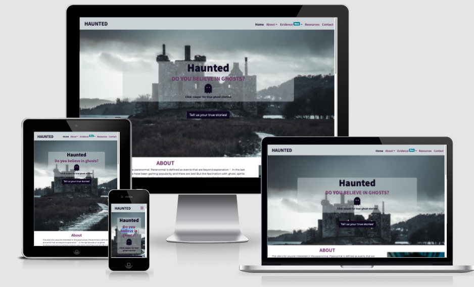
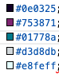
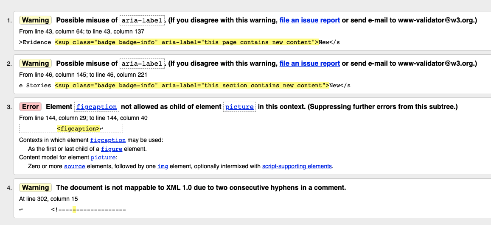
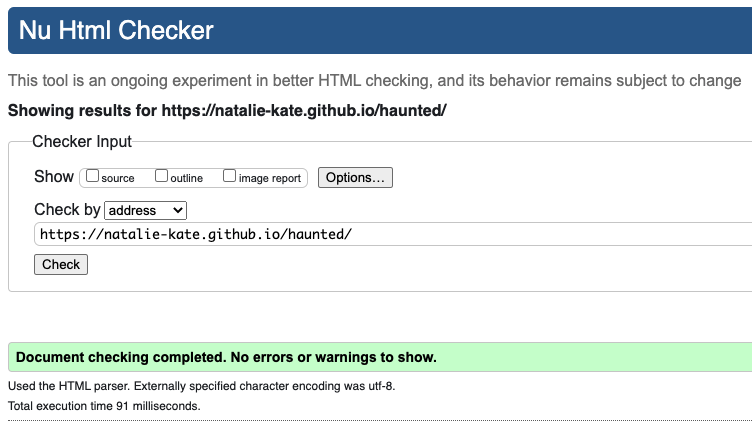
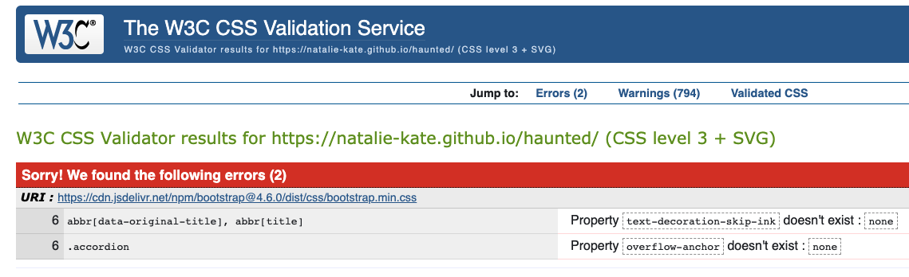

# Haunted Website

Here is a link to the live project. (https://natalie-kate.github.io/haunted/)

This website was created for Milestone 1- User Centric Frontend Development project, as part of the Code Institutes diploma in Software development.
 I wanted to create a site that provided information for people interested in the paranormal, in particular ghosts.

## Contents 

- [User Experience (UX)](#user-experience)
   * [Site Goals](#site-goals)
   * [User Stories](#user-stories) 
   * [Design](#design)
   * [Wireframes](#wireframes)

- [Features](#features)
   * [Current Features](#current-features)
   * [Features to implement in the future](#features-to-implement-in-the-future)

- [Technologies](#technologies)
   * [Languages used](#languages-used)
   * [Frameworks, Libraries & Programs Used](#frameworks-,-libraries-&-programs-used)

- [Testing](#testing)
   * [Automated Testing](#automated-testing)
   * [Testing User Stories](#testing-user-stories)
   * [Manual testing](#manual-testing)
   * [Bugs](#bugs)
      + [Found and Fixed](#found-and-fixed)
      + [Existing](#existing)

- [Deployment](#deployment)
- [Credits](#credits)
   * [Code](#code)
   * [Content](#content)
   * [Media](media)
   * [Acknowledgements](#acknowledgements)

## User Experience (UX)

   ### Site Goals
   User goals gained from a small survey.
   - As a user I want to be able to learn about ghosts and hauntings.
   - As a user who believes in the paranormal I want to read true stories and contribute my own.
   - As a user who's a cynic I want to see video and picture evidence. 
   - As a user I would want to read theories as what could cause paranormal phenomona.

   - As the site owner I want to teach people about the fascinating world of the paranormal, in particular hauntings and ghosts.
   - As the site owner I want to collect evidence of the paranormal e.g stories, pictures and videos.
   - As the site owner I want my site to be responsive to different screen sizes.
   - As the site owner I want my site to be accessible to my visitors.

   ### User Stories

   - #### First Time Visitor 

        1. As a first time visitor, I want to easily understand the main purpose of the site. 
        2. As a first time visitor, I want to be able to easily navigate throughout the site to find content.
        3. As a first time visitor, I expect to see an attractive, visually appealing site.
        4. As a first time visitor, I expect an accessible site.
        5. As a first time visitor, I expect the site to look good on my mobile device.

   - #### Returning Visitor Goals

        1. As a returning visitor, I want to easily identify new content.
        2. As a returning visitor, I want to see social media links so that I can follow on my chosen platforms.
        3. As a returning visitor, I want to see recommended resources to learn more.
        4. As a returning visitor, I want to be able to contact the owner with comments or questions.

    - #### Frequent Visitor Goals

        1. As a frequent visitor, I want to easily identify new content.
        2. As a frequent visitor, I want to sign up to the mailing list so that i'm informed of new content or features.
        3. As a frequent visitor, I want to send stories, pictures or videos to be added to the page.

   - ### Design
    -   #### Colour Scheme
        In project inception I looked at possibly a logo for my site on Wix. While I ultimately didn't go with the logo I 
        did find a colour scheme. I wanted to create an atmosphere, not too dark as to create a scary feel, horror is not 
        what we're aiming but not too cheery at the same time. 

        

        The navy/very dark purple and the purple set the tone. The grey is used for the nav and footer providing contrast 
        for the brand name and menu and was picked from the hero image. The very pale green is used to lift and highlight, 
        where as the darker green is used on the badges and for the keyboard focus outline to draw attention. The dark green
        was also used for the hover style of the reference sup element, as the writing is small it was hard to distinguish 
        the colour change from purple to the darker purple used on the other elements.
        
    -   #### Typography
        For the headers the font family is Noto Sans KR imported from Google fonts. To complement it I chose Montserrat 
        from the popoular pairings section of their website. I chose these as they are easy to read and do not distract 
        from the content itself. In addition they go well with the feel that I want to achieve, others would have not 
        suited the subject matter.
          
    -   #### Imagery
        The hero image was chosen for the moodyness the colours and the castle ruins portray. It conveys the sort of place
        that you would imagine to be haunted without being scary and putting people off the site. Similarly the header 
        image in the other two pages has the heavy purple clouds with the spooky ruins drawing you in. 
        The font-awesome ghost "Casper" is again to highlight that this is a light hearted site, not to be taken too seriously.
    
    -   #### Design choices
        I decided to use pictures, text, table and fact boxes in my design. Different ways of presenting information is 
        visually more interesting to a user and makes it easier to pick out sections to look at. As an information site I 
        wanted the content to be there for who is interested but also aware that some people will skip over paragraphs of 
        text so tried to use the design to break up the information into easier to digest sections.
        I chose to make the hero image min-height of 80vh so that there would be a space visible at the bottom of the screen
        indicating to the user to scroll.

   ### Wireframes 
Wireframes were created on Balsamiq (see links below)

* [Mobile](wireframes/ms1-mobile.pdf)
* [Tablet](wireframes/ms1-tablet.pdf)
* [Desktop](wireframes/ms1-desktop.pdf)

On mobile I had a one column design to allow nice spacing and easy to read content

On tablet I wanted two columns in some sections just to make the layout 
visually more interesting for the user.

On desktop I wanted to use the rule of 3. Some sections have 3 columns of equal width,
others have 2 columns one of a third and one of two thirds. Again this makes it visually 
interesting, helping distinguish between sections and prevents users becoming 
visually tired.

Difference from the wireframes to the final site were not many. 

The About and Introduction paragraphs ended up being on top of one another rather 
than side by side, this was due to the introduction being longer and creating 
an empty space which didn't look great.

Similarly with the media evidence section, originally the pictures and video 
were to be side by side but the video column had a lot of white space under 
it due to the pictures taking up more height.

A picture was also added in to the true stories section for tablet only. This is 
due to three stories being in one row and the rest in a new row (for hiding on 
mobile purposes) and so an empty space appeared that needed filled.

I also added another fact box in the further resources section to fill it out, it 
looked a bit sparse. 

## Features

### Current features

-   Responsive on all device sizes

-   Interactive elements

-   Social Links 

-   Easy to navigate (Single use learning)

-   Accessible 

### Features to implement in the future

Users ability to add pictures, videos and stories directly onto the page unable to
at the minute due to my limitations as a software developer.

Haunted House subscription
Sign up for exclusive content: 
- Location focus, each month a new location would be picked and its story told.
- Ghosts in the media, hauntings that have made the news or been made into films.

## Technologies 

### Languages Used

-   [HTML5](https://en.wikipedia.org/wiki/HTML5)
-   [CSS3](https://en.wikipedia.org/wiki/Cascading_Style_Sheets)
-   [Javascript] (https://en.wikipedia.org/wiki/JavaScript)

### Frameworks, Libraries & Programs Used

1. [Bootstrap v4.6.0](https://getbootstrap.com/docs/4.6.0/getting-started/introduction/)
    - Bootstrap was used for the initial layout and styling before customising it.
2. [Google Fonts](https://fonts.google.com/)
    - Google fonts were used to import the Noto Sans KR and Montserrat. 
3. [Font Awesome](https://fontawesome.com/)
    - Font Awesome 
4. [Git](https://git-scm.com/)
    - Git 
5. [GitHub](https://github.com/)
    - GitHub 
6. [Balsamiq](https://balsamiq.com/)
    - Balsamiq
7. [TinyJPG](https://tinyjpg.com/)
    - TinyJPG was used to optimise the images I used on my site to minimise loading time.
8. [Am I responsive](http://ami.responsivedesign.is/)
    - This was used to generate the image at the top of this README.
9. [Codepen]()

## Testing

### Automated Testing

The W3C Markup Validator and W3C CSS Validator were used to validate every page of the project to ensure there were no syntax errors in the project.

-   [W3C Markup Validator](https://jigsaw.w3.org/css-validator/#validate_by_input) 

    Initial testing
    
    Final testing
    
-   [W3C CSS Validator](https://jigsaw.w3.org/css-validator/#validate_by_input) 
    
    Initial testing
    
    Final testing
    
-   Lighthouse in devtools

-   Chrome Dev tools for responsiveness

### Testing User Stories 

- #### First Time Visitor 

 1. As a first time visitor, I want to easily understand the main purpose of the site. 
   The content overlay has a ghost icon that links to ghost stories, slogan of "Do you
    believe in Ghosts", and directly below is an About paragraph with the first sentence 
    explaining the purpose of the site.
 2. As a first time visitor, I want to be able to easily navigate throughout the site to find content. 
   The nav menu is at the top of all pages with drop down menus to find and jump to the section of 
   interest. The brand name is also a link back to home.
   In addition a "back to top" link is present in the footer meaning the user doesn't have to scroll back up to 
   the top, which is especially important for the mobile site.
3. As a first time visitor, I expect to see an attractive, visually appealing site.
    Used blocks of colour as the background colours for section headings to break up the page,
    and highlight a new section. Information is presented in different formats and hover effects draw attention to links 
    and call to action buttons. The same colours were consistantly used across the site for predicatability and simplicity 
    and doesn't look too busy which can be off putting.
4. As a first time visitor, I expect an accessible site.
   Aria labels, screen reader only text and alternative text have been used throughout the site. 
   Styled the outline of keyboard focus making it more obvious as to where they are on the page and colour ties in with the 
   other colours on the screen. All colour contrast scores were a pass in chrome dev tools and accessibility score was 100%
5. As a first time visitor, I expect the site to look good on any device I choose to use.
   Designed with mobile first in mind, using bootstrap and media queries to ensure that on all screen 
   sizes that the site looks good with no escaping contents or horizontal scrolling and that the hero and header images are positioned 
   correctly as these are what people see first upon loading so they have to be perfect.

   - #### Returning Visitor Goals

1. As a returning visitor, I want to easily identify new content.
   Bright badges have been used to highlight in the nav which page contains new 
   content, in the dropdown menu the section also has a badge and when you are taken to this section the new content
    itself is highlighted with the badge.
2. As a returning visitor, I want to see social media links so that I can follow on my chosen platforms.
    At the bottom of each page is the social platform icons with links to the pages. Only 
    takes you to the social media platform itself as accounts for this website don't exist in real life.
3. As a returning visitor, I want to see recommended resources to learn more.
    This is one of the main nav menu items and therefore easy to find and navigate to.
4. As a returning visitor, I want to be able to contact the owner with comments or questions.
    The contact page is one of the main nav items so is easy to find and navigate to. The 
    form has a text box to enter commentsand/or questions.

    - #### Frequent Visitor Goals

1. As a frequent visitor, I want to easily identify new content.
    Bright badges have been used to highlight in the nav which page contains new 
   content, in the dropdown menu the section also has a badge and when you are taken to this section the new content
    itself is highlighted with the badge. 
2. As a frequent visitor, I want to sign up to the mailing list so that i'm informed of new content or features.
    Contact is one of the main nav items so its easy to find and navigate to and there is a 
    checkbox to select to be added to the mailing list.
3. As a frequent visitor, I want to send stories, pictures or videos to be added to the page. 
    Contact is one of the main nav items so it is easy to find and navigate to. There is a 
    text box to add a story and a file upload input for pictures and videos. There is also a call to action button in the 
    landing page container to "Tell us your true stories", and two in the evidence page to "Share your experiences" and 
    "Share your photos and pictures"

   

### Manual Testing

-   The website was viewed with browsers: Internet explorer, Google chrome, Safari, Microsoft Edge, Chrome for 
    android, Firefox and Opera. Viewed all three pages on each and checked the links. Found that the contact form 
    link to resource section was wrong so that was amended.
-   Viewed manually on Macbook air 13", Dell 21" HD screen, iphone 11, Dell 17" laptop and Pixel 4XL phone.
-   Friends, family and slack peer review reported no issues. One commment was to increase spacing after 
    picture section and video heading which I did. 
-   Chrome devtools used to test responsiveness, viewed all pages on all of the available devices.
-   Links 

### Bugs

   #### Found and Fixed

   #### Existing
  

## Deployment

## Credits

### Code

-   

-   [Bootstrap4](https://getbootstrap.com/docs/4.1/getting-started/introduction/): Bootstrap Library used for the layout and styling.

### Content

-   

-   README layout from https://github.com/Code-Institute-Solutions/SampleREADME

### Media

 
 True story image https://www.pexels.com/@charles-parker
 Header image https://www.pexels.com/@peter-spencer
 Hero image https://www.pexels.com/@phil-964389

-   

-  

-   

### Acknowledgements

-   Code institute. 
-   
