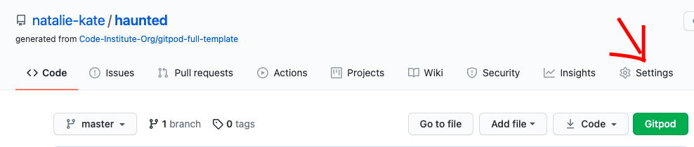
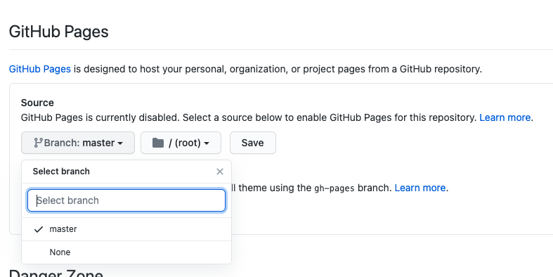
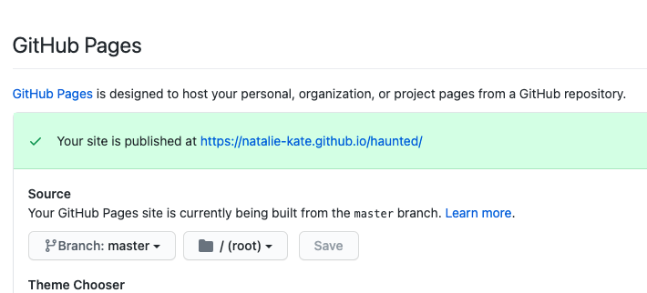
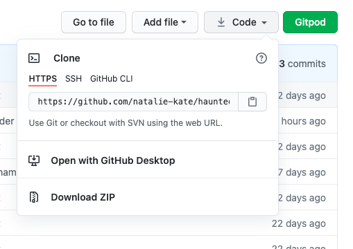

# Haunted Website

Here is a link to the live project. (https://natalie-kate.github.io/haunted/)

This website was created for Milestone 1- User Centric Frontend Development project, as part of the Code Institutes diploma in Software development.
I wanted to create a site that provided information for people interested in the paranormal, in particular ghosts.

## Contents 

- [User Experience (UX)](#user-experience-(ux))
   * [Site Goals](#site-goals)
   * [User Stories](#user-stories) 
   * [Structure](#structure)
   * [Design](#design)
   * [Wireframes](#wireframes)

- [Features](#features)
   * [Current Features](#current-features)
   * [Features to implement in the future](#features-to-implement-in-the-future)

- [Technologies](#technologies)
   * [Languages used](#languages-used)
   * [Frameworks, Libraries & Programs Used](#frameworks-,-libraries-&-programs-used)

- [Challenges](#challenges)

- [Testing](#testing)
   * [Automated Testing](#automated-testing)
   * [Testing User Stories](#testing-user-stories)
   * [Manual testing](#manual-testing)
   * [Bugs](#bugs)
      + [Found and Fixed](#found-and-fixed)
      + [Existing](#existing)

- [Deployment](#deployment)
- [Credits](#credits)
   * [Code](#code)
   * [Content](#content)
   * [Media](media)
   * [Acknowledgements](#acknowledgements)

## User Experience (UX)

   ### Site Goals 
   - User goals (Gained from a small survey)
     * As a user I want to be able to learn about ghosts and hauntings.
     * As a user who believes in the paranormal I want to read true stories and contribute my own.
     * As a user who's a cynic I want to see video and picture evidence. 
     * As a user I would want to read theories as what could cause paranormal phenomona.

   - Site owner/ business goals
     * As the site owner I want to teach people about the fascinating world of the paranormal, in particular hauntings and ghosts.
     * As the site owner I want to collect evidence of the paranormal e.g stories, pictures and videos.
     * As the site owner I want my site to be responsive to different screen sizes.
     * As the site owner I want my site to be accessible to my visitors.
     * As the site owner I want to build up a media presence and fan base to ultimately capitalise on that by introducing a 
     subscription club.

   ### User Stories

   - #### First Time Visitor 

        1. As a first time visitor, I want to easily understand the main purpose of the site. 
        2. As a first time visitor, I want to be able to easily navigate throughout the site to find content.
        3. As a first time visitor, I expect to see an attractive, visually appealing site.
        4. As a first time visitor, I expect an accessible site.
        5. As a first time visitor, I expect the site to look good on my mobile device.

   - #### Returning Visitor Goals

        1. As a returning visitor, I want to easily identify new content.
        2. As a returning visitor, I want to see social media links so that I can follow on my chosen platforms.
        3. As a returning visitor, I want to see recommended resources to learn more.
        4. As a returning visitor, I want to be able to contact the owner with comments or questions.

    - #### Frequent Visitor Goals

        1. As a frequent visitor, I want to easily identify new content.
        2. As a frequent visitor, I want to sign up to the mailing list so that i'm informed of new content or features.
        3. As a frequent visitor, I want to send stories, pictures or videos to be added to the page.

   ### Structure
-  I decided that it would make sense to have three pages with different sections on the home/about and evidence page. 
    The content took two distinct groups, that of information (Home/about page) and that of evidence. I believe 
    that on a site that is informational that encouraging users to pursue this new interest through
    further resources is important. As it didn't warrant a page to itself, due to its size, I chose to put this after the 
    video evidence as a few of the resources were to the channels that the videos themselves came from, so i thought this would 
    flow nicely. I did however give it its own listing in the navbar due to it being important for users to find and I also think 
    this section will become larger over time and will end up as its own page eventually. 
-  The contact form I chose to put on its own page instead of a modal as I wanted a decently sized text area for people to write in 
    and to have a confirmation modal to pop up on successful submission. In addition this page will have the sign in portal for paid 
    subscribers in the future. 
-   All pages will have a nav menu at the top and a footer at the bottom with the social links as this is what users expect 
    and they will therefore be able to navigate intuitively. On small screens the navigation menu will collapse into the burger 
    icon on the right hand side of the screen with the brand name on the left. 
-   I decided to include a Home and About menu item even though they are the same page as people expect home and about to be 
    listed. If I took away Home people may not be sure how to get back to the beginning from other pages. 

   ### Design

 -   #### Colour Scheme
        In project inception I looked at possibly a logo for my site on Wix. While I ultimately didn't go with the logo I 
        did find a colour scheme. I wanted to create an atmosphere, not too dark as to create a scary feel, horror is not 
        what we're aiming but not too cheery at the same time. 

        

        The navy/very dark purple and the purple set the tone. The grey is used for the nav and footer providing contrast 
        for the brand name and menu and was picked from the hero image. The very pale green is used to lift and highlight, 
        where as the darker green is used on the badges and for the keyboard focus outline to draw attention. The dark green
        was also used for the hover style of the reference sup element, as the writing is small it was hard to distinguish 
        the colour change from purple to the darker purple used on the other elements.
    
-   #### Typography
    For the headers the font family is Noto Sans KR imported from Google fonts. To complement it I chose Montserrat 
    from the popoular pairings section of their website. I chose these as they are easy to read and do not distract 
    from the content itself. In addition they go well with the feel that I want to achieve, others would have not 
    suited the subject matter.
        
-   #### Imagery
    The hero image was chosen for the moodyness the colours and the castle ruins portray. It conveys the sort of place
    that you would imagine to be haunted without being scary and putting people off the site. Similarly the header 
    image in the other two pages has the heavy purple clouds with the spooky ruins drawing you in. 
    The font-awesome ghost "Casper" is again to highlight that this is a light hearted site, not to be taken too seriously.

-   #### Design choices
    I decided to use pictures, text, table and fact boxes in my design. Different ways of presenting information is 
    visually more interesting to a user and makes it easier to pick out sections to look at. As an information site I 
    wanted the content to be there for who is interested but also aware that some people will skip over paragraphs of 
    text so tried to use the design to break up the information into easier to digest sections.
    I chose to make the hero image min-height of 80vh so that there would be a space visible at the bottom of the screen
    indicating to the user to scroll.

   ### Wireframes 
Wireframes were created on Balsamiq (see links below)

* [Mobile](assets/wireframes/ms1-mobile.pdf)
* [Tablet](assets/wireframes/ms1-tablet.pdf)
* [Desktop](assets/wireframes/ms1-desktop.pdf)

- On mobile I had a one column design to allow nice spacing and easy to read content

- On tablet I wanted two columns in some sections just to make the layout 
visually more interesting for the user.

- On desktop I wanted to use the rule of 3. Some sections have 3 columns of equal width,
others have 2 columns one of a third and one of two thirds. Again this makes it visually 
interesting, helping distinguish between sections and prevents users becoming 
visually tired.

- Difference from the wireframes to the final site were not many. 

- The About and Introduction paragraphs ended up being on top of one another rather 
 than side by side, this was due to the introduction being longer and creating 
 an empty space which didn't look great.

- Similarly with the media evidence section, originally the pictures and video 
 were to be side by side but the video column had a lot of white space under 
 it due to the pictures taking up more height.

- A picture was also added in to the true stories section for tablet only. This is 
  due to three stories being in one row and the rest in a new row (for hiding on 
  mobile purposes) and so an empty space appeared that needed filled.

- I also added another fact box in the further resources section to fill it out, it 
  looked a bit sparse. 

## Features

Within project conception, a list of features were compiled, these were the scored 
between 1 & 5 for importance and feasability/ viability which then decided which features 
could be included for initial launch.

### Current features

-   Responsive on all device sizes

-   Accessible 

-   Easy to navigate (Single use learning)

-   Interactive elements 

-   Social Links (build up media presence)

-   Ability to contact owner (contribute evidence of the paranormal)

-   Ability to sign up for a newsletter (build up a fan base)

### Features to implement in the future

-   Users ability to add pictures, videos and stories directly onto the page.
-   Haunted House subscription
    Sign up for exclusive content: 
     * Location focus, each month a new location would be picked and its story told.
     * Ghosts in the media, hauntings that have made the news or been made into films.
-   Haunted merchandise shop

## Technologies 

### Languages Used

-   [HTML5](https://en.wikipedia.org/wiki/HTML5)
-   [CSS3](https://en.wikipedia.org/wiki/Cascading_Style_Sheets)
-   [Javascript](https://en.wikipedia.org/wiki/JavaScript)

### Frameworks, Libraries & Programs Used

1. [Bootstrap v4.6.0](https://getbootstrap.com/docs/4.6.0/getting-started/introduction/)
    - Bootstrap was used for the initial layout and styling before customising it.
2. [Google Fonts](https://fonts.google.com/)
    - Google fonts were used to import the Noto Sans KR and Montserrat. 
3. [Font Awesome](https://fontawesome.com/)
    - Social media icons in footer and section icons on evidence page.
4. [Git](https://git-scm.com/)
    - Version control.
5. [GitHub](https://github.com/)
    - For storing code and deploying the site.
6. [Gitpod](https://www.gitpod.io/)
    - Used for editing my code.
7. [Balsamiq](https://balsamiq.com/)
    - Wireframe creation
8. [TinyJPG](https://tinyjpg.com/)
    - TinyJPG was used to optimise the images I used on my site to minimise loading time.
9. [Am I responsive](http://ami.responsivedesign.is/)
    - This was used to generate the image at the top of this README.
10. [Codepen](https://codepen.io/your-work)
       - Codepen was used to try out and edit the read more button.
11. [Chrome devtools](https://developer.chrome.com/docs/devtools/)
    - This was used massively throughout development to troubleshoot, try out changes before 
   changing code, to test responsiveness and for testing performance of the final site with lighthouse. 

## Challenges 
   These are aspects of the development that took me a while to figure out due to inexperience with 
   coding and bootstrap. 
   -  Nav
        * Could not see the nav toggler icon when in mobile view. Realised that because I hadn't chosen a 
        nav-dark or nav-light bootstrap class it hadn't given it a colour but that it was there. As I wanted my 
        own colour scheme anyway I tried to target the toggler with my own colour.  
        Solution: After a google search stack overflow advice was to swap the bootstrap toggler icon to the font 
        awesome one and then I could style it.
        * Getting my menu to align to the right. Solution: ml-auto bootstrap class 
        applied to the unordered list.
        * Menu icon not working  Solution: Hadn't given an id to the unordered list
         to target.
        * Wanted to style the burger icon menu. Initially had opaqness on nav set to 0.5 but where the navbar and dropdown
         overlapped was obviously a line of full opaqness and the dropdown didnt fill the full width of the screen. Felt like
         I had messed up the nav as I had taken the one from whiskey drop and deleted and edited to suit. It was the first 
         element on my page I had worked on and an empty screen had been daunting so now having issues with it, I deleted 
         the whole thing and started again using bootstrap documentation to write my own and then ultimately ended up copying 
         and pasting from bootstrap their nav code and ended up with the same issue.  
         Solution: Padding on the navbar was translating to gaps either side of the dropdown,
         removed this padding, changed colour of nav from 0.5 to fully opaque and a lighter grey as fully opaque had then started 
         causing contrast issues.
   - Font awesome ghost icon not displaying. Solution: Font awesome version had updated
    to 5.15.2 and my link was for the older one.
   - Image centered in div. Tried img-fluid class, align-items, text-align, align-self, justify contents, margin 0 auto, 
     margin auto with container at 33vw, display:flex etc. Searched and found some answers on stack overflow. Used bits 
     from two answers. Solution: position: absolute; display: inline; left: 50%; transform: 
     translate(-50%);
   - Background image not displaying when deployed to github pages. Had heard there could be issues with file paths 
     which is why you should deploy early in the development which is why I did thankfully. Tried numerous file paths,
     then tried changing the image file size as it was quite large.  Solution: background-color
     was overiding the background-image, I wasn't loving the background having a color as it was a bit much so just removed 
     it. If I was keeping it I would have give the image a z-index.
   - Read more button
       * Tried doing it with the button element, along with the stack overflow code for hiding and then unhiding a div. This
        didn't work and so I used the stack overflow code, this time including styling the input label to look like a button. 
        I had given all my divs to be hidden bootstrap classes for the different screen sizes including d-none. Tried to target 
        the d-none to unhide upon clicking. This did not work, I realised from the stack overflow example that the stories, 
        input and label all have to be within the same div to work, so removed all the bootstrap classes gave them all a class 
        of .hide and enclosed them all in one parent div. The button now worked but I now had to style them to be resposnsive 
        in the same way as the three stories shown across all devices that had bootstrap classes. 
        Solution: Ended up reverting back to bootstrap classes and using a media query for smaller 
        screens to hide and unhide the div rather than that being the default style. I then could add my bootstrap classes back in
        and just hide the button on medium and large screens. As the hidden stories were in a new row, this created a gap on the 
        medium screens, so I filled this with an image.
    - Realised I had a horizontal scroll, Thought it was the nav as the content box seemed to be outwith the screen size. Tried 
      to move things about, removed the right align, changed about the .row and .col classes, this didn't help. Commented out the 
      nav entirely and the scrolling issue was still there. This led me to realise that all my rows were escaping the container. 
      Solution: Found on stack overflow to target row with 100vh and body & html with width: 100% and 
      overflow-x: hidden. This seemed to fix the scrolling even though I couldn't see any content that was overflowing to cause it. 
      Upon further research I found that rows by default have a margin of -15px and the containers default margin counteracts it. 
      Thus changing my container-fluid to margin: 0 so that my background image would reach the edge caused the issue. I ended up
      taking the nav out of the container-fluid as by default nav is responsive and doesn't need to be in a container.
    - Successful submission modal would pop up for a second and disappear before a user had a chance to read it. Changed button type 
      from submit to button and removed method and action attributes which brought the modal up but would do that even if the form 
      hadn't been filled in with the required info (personal info). Found a student that had got a modal on her MS1 and seen that 
      her mentor had written some Javascript for her, tried it but couldn't get it to work, then tried one I found on codepen and 
      couldn't get that work to either. 
      Solution: Javascript code from codepen with the script after the other scripts rather than above 
      them. And using input type button without the method and action atributes.

   
## Testing

Testing and results can be found [here](testing.md)

## Deployment

 - ### Creation 

       I created this repository by:
       (a) Logging into github and clicked the green new button.
       (b) This took me to the page below. I selected the code institute template, input a repository name and clicked the 
       green create repository button.

          

       (c) Opened new repository and clicked green Gitpod button to create a workspace in gitpod for editing.

 - ### Github pages

       I deployed my project to gihub pages by:

       (a) Logged in to github and opened my [repository](https://github.com/natalie-kate/haunted) 
       (b) From here clicked settings, see picture below.

           

       (c) In settings scrolled down to Github pages, here under source branch I selected Master 
           and kept the default root and then clicked save.

            

       (d) After a minute or two the page has now published and the site address is available in the github page section.

          

 - ### Forking
   (a) To fork my project sign in to Github and go to my [repository](https://github.com/natalie-kate/haunted) 
   (b) Above and to the right of the settings there are three options and the far right one says Fork, select this. 
   (c) The fork is now in your repositories.

 - ### Clone
   To clone my project sign in to Github and go to my [repository](https://github.com/natalie-kate/haunted) 
   * Clone using command line
     + Next to the green Gitpod button is a button that says code, select this. There is a few options as to how you 
       would like to clone, if you choose https, SSH or Github CLI, select the clipbard icon to copy the URL.
     + In your workspace that you've created, in the terminal , type git clone, paste the URL and enter.

     
   * Desktop Github
     + If you choose to clone by selecting open with desktop Github, it will guide you through the clone with prompts. 
   For more information or troubleshooting see the Github documentation 
   [here](https://docs.github.com/en/github/creating-cloning-and-archiving-repositories/cloning-a-repository#about-cloning-a-repository)
   
## Credits

### Code

-   [Bootstrap4](https://getbootstrap.com/docs/4.1/getting-started/introduction/): Bootstrap Library used for the layout and styling. Most prominantly seen in the 
    nav bar as I was having issues with it, see challenges section above and modal. Modal made my own by deleting sections adding an icon and styling.
-   Chiller on stack overflow for hide button [answer](https://stackoverflow.com/questions/42267467/how-to-toggle-effect-in-div-using-only-css)
    used bits of his code which are marked in CSS.
-   Josh Comeau for his button animation code and the media query for reduced motion preference. [Article](https://www.joshwcomeau.com/animation/css-transitions/)
-   Davide Sanfilippo javascript for modal to only appear when form submitted correctly. [Codepen](https://codepen.io/dasan/pen/vqaLPe)
-   Centering image in div code I used was a combination of two answers on stack overflow:
                                position: absolute;     
                                display: inline;       
                                left: 50%;                   
                                transform: translate(-50%);  
-   Escaping rows fix added to body. From stack overflow: width: 100%;
                                                          overflow-x: hidden;

### Content

-   Content was created by Natalie Alexander, using information from the following refernces that have been linked to in the content itself..
     * (1)https://www.collinsdictionary.com/dictionary/english/paranormal
     * (2)https://www.livescience.com/26697-are-ghosts-real.html
     * (3)http://www.victorianweb.org/victorian/religion/spirit.html
     * (4)https://www.livescience.com/26697-are-ghosts-real.html
     * (5)https://info.umkc.edu/unews/ghosts-and-grief-umkc-professor-discusses-supernatural-beliefs-around-the-world/
     * (6)https://www.sciencedirect.com/science/article/abs/pii/S0160738310001209
     * (7)https://www.researchgate.net/publication/291333882_Ghostly_Encounters_The_Hauntings_of_Everyday_Life
     * (8)https://www.goodreads.com/book/show/2244062.The_Complete_Book_of_Ghosts
     * (9)https://inews.co.uk/news/science/are-ghosts-real-rational-theories-sightings-sceptics-halloween-356151 
-   README and TESTING took ideas and inspiration for layout and content from these excellent examples:
    * [Code institute](https://github.com/Code-Institute-Solutions/SampleREADME)
    * [Daisy McGirr](https://github.com/Daisy-McG/MilestoneProject-1/blob/master/README.md)
    * [Richard Henyash](https://github.com/richardhenyash/artofnht/blob/darktheme/README.md)
    * [byllsa](https://github.com/byIlsa/Aloy-from-outcast-to-heroine)

### Media

 - Picture evidence pictures from [Wiki commons](https://commons.wikimedia.org/wiki/Category:Spirit_photography)
 - True story image [Charles Parker, Pexels](https://www.pexels.com/@charles-parker)
 - Header image [Peter Spencer, Pexels](https://www.pexels.com/@peter-spencer)
 - Hero image [Phil, Pexels](https://www.pexels.com/@phil-964389)
 - Introduction image [Teksomilika, Freepik](https://www.freepik.com/teksomolika) 
 - Further resources image [Erik McLean, pexels](https://www.pexels.com/@introspectivedsgn)
 - Youtube videos from:
   * [Lainey & Ben](https://www.youtube.com/channel/UCvLU692Wv1T9Qjz96YVhLtg)
   * [Nukes top 5](https://www.youtube.com/channel/UCBnbnH7DGXT9yBBVFbZeIwQ)
   * [Sabia el](https://www.youtube.com/channel/UCgoIgr6MekEKM3hRnaZc9rQ)
   * [Elvis and Khaleesi](https://www.youtube.com/channel/UCpjDFtZdjDuAzE0H-c2rxoQ)

### Acknowledgements

-   Code institute. 
-   My mentor Victor Miclovich
-   My mini feb 2021 team on slack for their feedback
