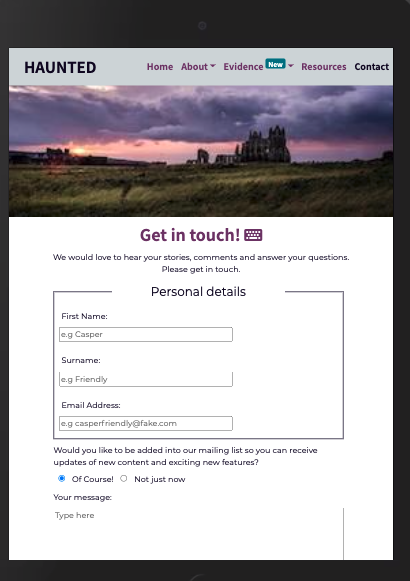
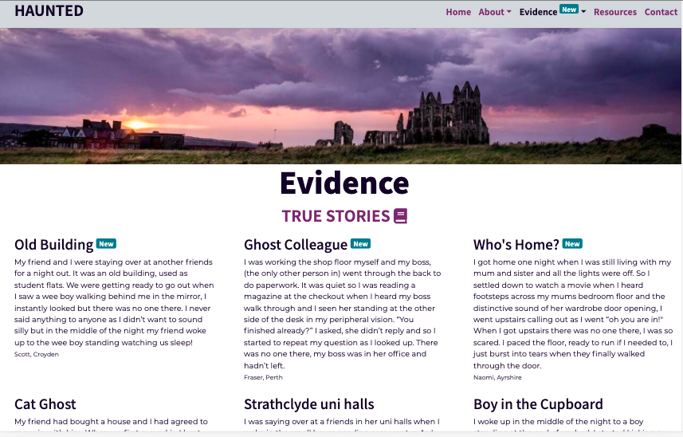
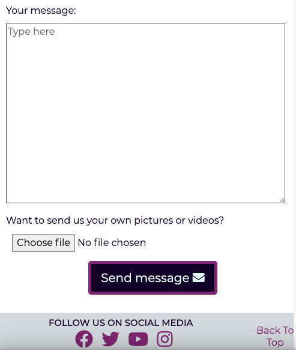

# Testing

## Contents 
   - [Automated Testing](#automated-testing)
      * [HTML validation](#w3c-markup-validator)
      * [CSS validation](#w3c-css-validator)
      * [Lighthouse testing](#lighthouse-in-devtools)
   - [Testing User Stories](#testing-user-stories)
   - [Manual testing](#manual-testing)
   - [Bugs](#bugs)
      * [Found and Fixed](#found-and-fixed)
      * [Existing](#existing)

## Automated Testing

The W3C Markup Validator and W3C CSS Validator were used to validate every page of the project to ensure there were no 
syntax errors in the project.

-   ## [W3C Markup Validator](https://jigsaw.w3.org/css-validator/#validate_by_input) 

    ### Initial testing
    - index.html

    

    From this I removed the aria label from the badges, reformatted my comment and removed figcaption from my 
    picture. Changed the figcaption to paragraph, but did not like either so just made it an img element with a 
    paragraph below for the attribute.

    - evidence.html

    

    I had missed a bracket in the media attribute of a few source elements so I added them in.
    
    
    I had put paragraph elements in my iframes to give a message with a link to the video in the event that
    the video would't load. This isn't allowed so I put the paragraph below the iframe and encased them both
    in a div. Styled with media queries to be responsive.
    Near the end of the project I re-ran it through and I had to remove loading, width and height attributes from 
    the source elements. 
    
    - contact.html

    
    
    ### Final testing (for those that needed fixed)
    - index.html

    

    - evidence.html

    

-   ## [W3C CSS Validator](https://jigsaw.w3.org/css-validator/#validate_by_input) 
    
    ### Initial testing

    

    Had wrote display:relative instead of position: relative for an image.
    Had also put a comma instead of a semi-colon at the end of text-decoration: none.

    

    Ran again near end of project and I hadn't put px in some of the font-size styles.

    ### Final testing

    

-   ## [Lighthouse](https://chrome.google.com/webstore/detail/lighthouse/blipmdconlkpinefehnmjammfjpmpbjk?hl=en) in devtools
    
    ### Initial scores 

    #### Landing page

    + Initial lighthouse score for landing page on desktop was Performance 77, Accessible 92, Best Practices 87 and SEO 91
    
    + Initial mobile

    

    #### Evidence Page

    + Initial desktop

    

    + Initial mobile

    

    #### Contact Page

    + Desktop and mobile initial and final values didn't change much so I have just included the final test results

    ### Actions taken

    From these scores I added in meta description, keywords and author. rel:noopener to my extenal links and changed 
    an h2 to an h5. I had used in the h2 in my fact-box where I should have used the h5 and styled the font-size. I 
    also had skipped h3 so I changed the h4's to h3's. Went over all my buttons and links ensuring I had aria labels 
    and images had alt text, darkened the badge colour to increase contrast. Due to these changes the rest of my 
    tests had 100% accessibilty, Best Practices and SEO so just had to focus on performance.
    
    Lighthouse didn't like that the images didn't have explicit width and height attributes so added them in.
    Removed scripts from both evidence and index pages as seemed to be a major rendor blocking resource. Helped
    fractionally but then had to add them back in when I realised I needed them for the bootstrap dropdown 
    toggled menu to work.

    Images were still an issue, found an article that mentioned using the loading attribute, so added with a 
    value of lazy to all my images and iframes. That helped immensely.
    First contentful paint still slow, mostly this seems to be down to the external CDN's such as bootstrap 
    and font awesome. Did highlight that one of my image files was still quite large so resized image 15, along with
    both my main landing page image and header image for mobile screens. 

    ### Final test 

    #### Landing page

    + Final Desktop (see report [here](testing/testing-reports/landing-page-desktop.pdf))

    

    + Final mobile (see report [here](testing/testing-reports/landing-page-mobile.pdf))

    

    #### Evidence page

    + Final desktop (see report [here](testing/testing-reports/evidence-desktop.pdf))

    

    + Final mobile (see report [here](testing/testing-reports/evidence-mobile.pdf))

    

    #### Contact Page

    + Final Desktop (see report [here](testing/testing-reports/contact-desktop.pdf))

    

    + Final Mobile (see report [here](testing/testing-reports/contact-mobile.pdf))

    

## Testing User Stories 

- ### First Time Visitor 

 1. As a first time visitor, I want to easily understand the main purpose of the site. 
   The content overlay has a ghost icon that links to ghost stories, slogan of "Do you
    believe in Ghosts", and directly below is an About paragraph with the first sentence 
    explaining the purpose of the site.

    
    
 2. As a first time visitor, I want to be able to easily navigate throughout the site to find content. 
   The nav menu is at the top of all pages with drop down menus to find and jump to the section of 
   interest. The brand name is also a link back to home.

      

    In addition a "back to top" link is present in the footer meaning the user doesn't have to scroll back up to 
    the top, which is especially important for the mobile site.

    

3. As a first time visitor, I expect to see an attractive, visually appealing site.
    Used blocks of colour as the background colours for section headings to break up the page,
    and highlight a new section. Information is presented in different formats and hover effects draw attention to links 
    and call to action buttons. The same colours were consistantly used across the site for predicatability and simplicity 
    and doesn't look too busy which can be off putting.

    
    

4. As a first time visitor, I expect an accessible site.
   Aria labels, screen reader only text and alternative text have been used throughout the site. 
   Styled the outline of keyboard focus making it more obvious as to where they are on the page and colour ties in with the 
   other colours on the screen. All colour contrast scores were a pass in chrome dev tools and accessibility score was 100%.
   As the buttons have an animation hover effect added in code in the case of user prefers reduced motion to turn the animation 
   off but to change colour instead so they still see clickable elements. 

   

5. As a first time visitor, I expect the site to look good on any device I choose to use.
   Designed with mobile first in mind, using bootstrap and media queries to ensure that on all screen 
   sizes that the site looks good with no escaping contents or horizontal scrolling and that the hero and header images are positioned 
   correctly as these are what people see first upon loading so they have to be perfect. As mobile users can't see hover effect on 
   buttons, gave them a border colour to make it clearer that they are clickable.

    
    
   

    
    
   

    
    
   

- ### Returning Visitor Goals

1. As a returning visitor, I want to easily identify new content.
   Bright badges have been used to highlight in the nav which page contains new 
   content, in the dropdown menu the section also has a badge and when you are taken to this section the new content
    itself is highlighted with the badge.

    

2. As a returning visitor, I want to see social media links so that I can follow on my chosen platforms.
    At the bottom of each page is the social platform icons with links to the pages. Only 
    takes you to the social media platform itself as accounts for this website don't exist in real life.

    

3. As a returning visitor, I want to see recommended resources to learn more.
    This is one of the main nav menu items and therefore easy to find and navigate to.

    
    
4. As a returning visitor, I want to be able to contact the owner with comments or questions.
    The contact page is one of the main nav items so is easy to find and navigate to. The 
    form has a text box to enter comments and/or questions.

    

- ### Frequent Visitor Goals

1. As a frequent visitor, I want to easily identify new content.
    Bright badges have been used to highlight in the nav which page contains new 
   content, in the dropdown menu the section also has a badge and when you are taken to this section the new content
    itself is highlighted with the badge. 

    

2. As a frequent visitor, I want to sign up to the mailing list so that i'm informed of new content or features.
    Contact is one of the main nav items so its easy to find and navigate to and there is a 
    checkbox to select to be added to the mailing list.

    

3. As a frequent visitor, I want to send stories, pictures or videos to be added to the page. 
    Contact is one of the main nav items so it is easy to find and navigate to. There is a 
    text box to add a story and a file upload input for pictures and videos. There is also a call to action button in the 
    landing page container to "Tell us your true stories", and two in the evidence page to "Share your experiences" and 
    "Share your photos and pictures"

    
    
    

## Manual Testing

-   The website was viewed with browsers: Internet explorer, Google chrome, Safari, Microsoft Edge, Firefox
    and Opera. Viewed all three pages on each and checked the following:
    +
    + Found that the contact form link to resource section was wrong so that was amended.
-   Viewed manually on Macbook air 13", Dell 21" HD screen, iphone 11, Dell 17" laptop and Pixel 4XL phone.
-   Friends, family and slack peer review used. Devices and browsers were iphone 11: Safari (x3), iphone XS Max: Safari,
    iphone 6: Chrome, iphone XR: safari, iphone 11 Pro: Safari, iphone 10: Safari, Samsung S20 FE: Chrome, Samsung tab 7,
    Huawei tablet and HP chromebook.
    +  One commment was to increase spacing after picture section and video heading which I did.
    +  Another found that the burger icon wasn't working. This was when I had removed the javascript to try
    and improve performance score before realising I needed the javascript for the collapsible menu. Thankfully it was only out for 
    10 minutes 
-   Chrome devtools used to test responsiveness, viewed all pages on all of the available devices.
-   Links 

## Bugs

   ### Found and Fixed

   ### Existing